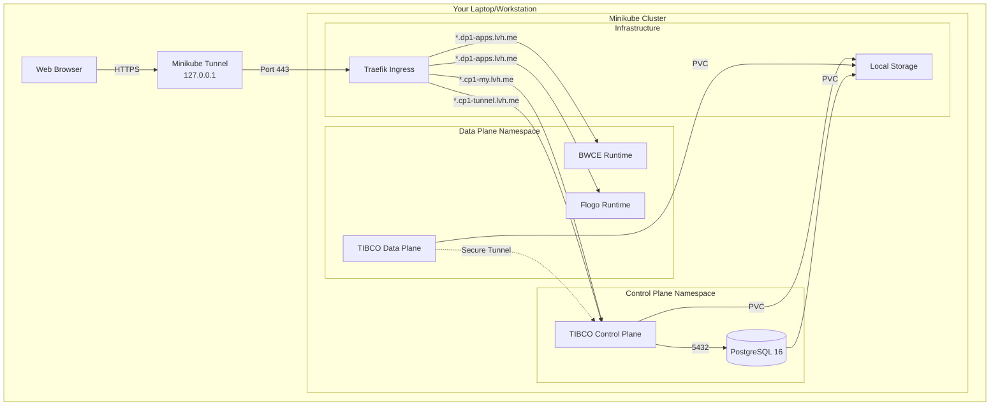

# TIBCO Platform on Minikube Workshop

> 📖 **View this guide on GitHub Pages** with interactive diagrams: [https://tibco-bnl.github.io/workshop-tp-minikube/](https://tibco-bnl.github.io/workshop-tp-minikube/)  

This repository provides comprehensive guides and resources for deploying **TIBCO Platform** on **Minikube** for local development and testing. It offers a complete local Kubernetes environment for learning, development, and demonstrating TIBCO Platform capabilities.

## 🎯 What This Repository Helps You Setup

### 1. **TIBCO Platform Control Plane (CP) + Data Plane (DP) on Minikube**
Deploy a complete TIBCO Platform environment with both Control Plane and Data Plane on a local Minikube cluster for development, testing, and learning purposes.

### 2. **No Cloud Infrastructure Required**
Everything runs locally on your laptop or workstation - no Azure, AWS, or GCP account needed!

### 3. **Perfect for Learning and Development**
- Test TIBCO Platform features locally
- Develop and test applications before cloud deployment
- Workshop and training environments
- Proof of concept demonstrations
- Cost-effective development environment

## 📚 Documentation Structure

### 🏗️ Complete Setup Guide

#### [📖 How to Set Up Minikube with Control Plane and Data Plane](./howto/how-to-cp-and-dp-minikube-setup-guide.md)
**Comprehensive guide for complete TIBCO Platform deployment on Minikube**
- 🎯 **Scope**: Minikube cluster setup + Control Plane + Data Plane on same cluster
- 🔧 **Features**: 
  - Minikube cluster configuration and resource allocation
  - In-cluster PostgreSQL 16 deployment
  - Storage provisioning with hostPath
  - Ingress controller setup (Traefik recommended)
  - DNS configuration using lvh.me (no external DNS required)
  - Self-signed certificate generation with comprehensive SANs
  - Complete Control Plane and Data Plane deployment
  - Admin user setup and password retrieval
- 📋 **Use Case**: Local development, testing, learning, workshops
- ⏱️ **Duration**: 2-3 hours for complete setup
- 💻 **Requirements**: 16GB RAM, 50GB disk space

### 🔧 Supporting Scripts

#### [🔐 Environment Variables Setup](./scripts/minikube-env-variables.sh)
**Centralized environment configuration script**
- Sets up all required environment variables
- Configures Minikube resource allocation
- Defines Control Plane and Data Plane domains
- Database and storage configuration
- Container registry credentials
- Automatically generates lvh.me domains

#### [🔒 Certificate Generation Script](./scripts/generate-certificates-minikube.sh)
**Self-signed SSL certificate generator with comprehensive SAN coverage**
- Generates Certificate Authority (CA)
- Creates certificates for MY domain with all required SANs
- Creates certificates for TUNNEL domain
- Creates combined certificate covering all domains
- Includes hybrid proxy URLs in SANs
- Generates Kubernetes secret creation commands
- Optional: Trust CA certificate on local system

## 🚀 Quick Start

### Prerequisites

- **Operating System**: macOS or Linux
- **RAM**: 16GB minimum (20GB recommended)
- **Disk Space**: 50GB free
- **Tools to Install**:
  - kubectl
  - Helm 3.17.0+
  - Minikube 1.34.0+
  - OpenSSL
  - Docker (for Minikube driver)

### Quick Installation (30 seconds overview)

```bash
# 1. Clone this repository
git clone <repository-url>
cd workshop-tp-minikube

# 2. Set environment variables
source scripts/minikube-env-variables.sh

# 3. Start Minikube
minikube start -p ${MINIKUBE_PROFILE} --cpus 6 --memory 16384 --disk-size 50g

# 4. Start Minikube Tunnel (in separate terminal - keep it running)
minikube tunnel -p ${MINIKUBE_PROFILE}

# 5. Follow the comprehensive setup guide
# See: howto/how-to-cp-and-dp-minikube-setup-guide.md
```

For detailed step-by-step instructions, follow the [complete setup guide](./howto/how-to-cp-and-dp-minikube-setup-guide.md).

## 🏛️ Architecture



## 🔑 Key Features for Minikube

### 1. **DNS Strategy - No External DNS Required**
Using **lvh.me** for automatic DNS resolution:
- `account.cp1-my.lvh.me` → resolves to `127.0.0.1`
- `tunnel.cp1-tunnel.lvh.me` → resolves to `127.0.0.1`
- `myapp.dp1-apps.lvh.me` → resolves to `127.0.0.1`

**Why lvh.me instead of nip.io?**
TIBCO's router component validates FQDNs and rejects domains containing IP patterns like `127.0.0.1`. The lvh.me service provides cleaner domain names that pass FQDN validation.

No need to configure `/etc/hosts` or set up a DNS server!

### 2. **Certificate Strategy - Comprehensive SANs**
Self-signed certificates with all required Subject Alternative Names:
- Control Plane MY domain: `*.cp1-my.lvh.me`
- Control Plane TUNNEL domain: `*.cp1-tunnel.lvh.me`
- Data Plane apps: `*.dp1-apps.lvh.me`
- Hybrid proxy URLs: `hybridproxy.cp1-my.lvh.me`
- localhost and 127.0.0.1

Single certificate generation script creates all certificates with proper SANs!

### 3. **Storage Strategy - Local HostPath**
Minikube's built-in storage provisioner:
- StorageClass: `standard` (default)
- Provisioner: `k8s.io/minikube-hostpath`
- NO need for cloud storage configuration
- Dynamic provisioning supported

### 4. **Network Strategy - Minikube Tunnel**
LoadBalancer services exposed via `minikube tunnel`:
- Runs in foreground (keep terminal open)
- Maps LoadBalancer services to 127.0.0.1
- Requires sudo password for port binding (80, 443)
- NO cloud load balancer costs!

### 5. **Database Strategy - In-Cluster PostgreSQL**
PostgreSQL 16 deployed in Control Plane namespace:
- NO external database service required
- Uses TIBCO's official PostgreSQL Helm chart
- Persistent storage with local volumes
- Suitable for development and testing

## 📋 What's Different from Cloud Deployments?

| Aspect | Cloud (AKS/EKS/GKE) | Minikube |
|--------|---------------------|----------|
| **Infrastructure** | Cloud provider managed | Local Minikube cluster |
| **DNS** | Azure DNS, Route53, Cloud DNS | lvh.me (automatic resolution) |
| **Certificates** | Let's Encrypt or managed certs | Self-signed certificates |
| **Storage** | Cloud storage (Azure Disk, EBS, PD) | Local hostPath |
| **Database** | Managed DB service | In-cluster PostgreSQL |
| **Load Balancer** | Cloud LB (costs money) | Minikube tunnel (free) |
| **Network** | VNet/VPC peering | Local networking |
| **Cost** | $$ per month | Free (local resources) |
| **Use Case** | Production | Development/Testing |

## 🎓 Learning Path

### Beginners
1. Start with the [complete setup guide](./howto/how-to-cp-and-dp-minikube-setup-guide.md)
2. Follow step-by-step instructions
3. Understand each component as it's deployed
4. Access the Control Plane UI and explore

### Intermediate Users
1. Review the quick start commands
2. Customize environment variables for your needs
3. Modify resource allocation (CPU/memory)
4. Experiment with different configurations

### Advanced Users
1. Deploy additional capabilities (EMS, Hawks, etc.)
2. Configure observability stack
3. Test hybrid scenarios with cloud Control Plane
4. Use as a development environment for application development

## 🛠️ Customization Options

### Resource Allocation

Adjust Minikube resources in `scripts/minikube-env-variables.sh`:

```bash
export MINIKUBE_CPUS="8"        # Increase for better performance
export MINIKUBE_MEMORY="20480"  # 20GB RAM
export MINIKUBE_DISK_SIZE="60g" # More disk space
```

### DNS Options

**Default: lvh.me (Recommended)**
lvh.me automatically resolves subdomains to 127.0.0.1 and works with TIBCO's router FQDN validation.

```bash
export DNS_SUFFIX="lvh.me"
```

If lvh.me doesn't work in your network:

**Option 1: Use /etc/hosts**
```bash
# Add entries to /etc/hosts
sudo tee -a /etc/hosts <<EOF
127.0.0.1 account.cp1-my.local
127.0.0.1 platform.cp1-my.local
127.0.0.1 tunnel.cp1-tunnel.local
EOF
```

**Option 2: Use sslip.io (with dashes)**
```bash
# Note: Use dashes instead of dots for IP
export DNS_SUFFIX="127-0-0-1.sslip.io"
```

### Ingress Controller

Choose between Traefik (recommended) or NGINX:

```bash
# In minikube-env-variables.sh
export TP_INGRESS_CONTROLLER="traefik"  # or "nginx"
```

## 📊 System Requirements

### Minimum Requirements
- **CPU**: 6 cores
- **RAM**: 16GB
- **Disk**: 50GB free space
- **OS**: macOS 11.0+ or Linux (Ubuntu 20.04+)

### Recommended Requirements
- **CPU**: 8 cores
- **RAM**: 20GB
- **Disk**: 60GB free space
- **OS**: macOS 12.0+ or Linux (Ubuntu 22.04+)

### Validated Configurations

✅ **Tested and Working:**
- macOS 13.x (Ventura) with Docker Desktop
- macOS 14.x (Sonoma) with Docker Desktop
- Ubuntu 22.04 LTS with Docker
- Ubuntu 24.04 LTS with Docker

## 🐛 Troubleshooting

Common issues and solutions are documented in the [setup guide](./howto/how-to-cp-and-dp-minikube-setup-guide.md#part-11-troubleshooting).

### Quick Fixes

**Minikube won't start?**
```bash
minikube delete -p tibco-platform
minikube start -p tibco-platform --cpus 6 --memory 16384 --disk-size 50g
```

**Tunnel not providing external IPs?**
```bash
# In a separate terminal, keep this running:
minikube tunnel -p tibco-platform
```

**DNS not resolving?**
```bash
# Test lvh.me resolution
nslookup account.cp1-my.lvh.me
# Should return 127.0.0.1

# Or use dig
dig +short account.cp1-my.lvh.me
# Should return 127.0.0.1
```

**Pods in CrashLoopBackOff?**
```bash
# Check logs
kubectl logs -n cp1-ns <pod-name>

# Describe pod
kubectl describe pod -n cp1-ns <pod-name>
```

## 🔒 Security Considerations

### For Development/Testing
- ✅ Self-signed certificates are acceptable
- ✅ Simple passwords are acceptable  
- ✅ Local-only access is secure

### For Production
- ❌ **DO NOT** use this setup for production
- ❌ **DO NOT** use self-signed certificates
- ❌ **DO NOT** use weak passwords
- ✅ Use cloud-based deployments (AKS, EKS, GKE)
- ✅ Use proper certificates from CA
- ✅ Follow security best practices

## 📚 Additional Resources

### TIBCO Documentation
- [TIBCO Platform Documentation](https://docs.tibco.com/products/tibco-platform)
- [Control Plane Installation Guide](https://docs.tibco.com/pub/platform-cp/latest/doc/html/Default.htm)
- [Data Plane Installation Guide](https://docs.tibco.com/pub/platform-dp/latest/doc/html/Default.htm)

### Community
- [TIBCO Community](https://community.tibco.com/)
- [TIBCO Platform Community Space](https://community.tibco.com/products/tibco-platform)

### Related Workshops
- [workshop-tp-aks](../workshop-tp-aks) - TIBCO Platform on Azure Kubernetes Service
- [workshop-tp-aro](../workshop-tp-aro) - TIBCO Platform on Azure Red Hat OpenShift
- [workshop-tibco-platform](../workshop-tibco-platform) - General TIBCO Platform resources

## 🤝 Contributing

Contributions are welcome! Please:
1. Fork the repository
2. Create a feature branch
3. Submit a pull request with clear description

## 📝 License

This project is licensed under the same license as specified in the [LICENSE](LICENSE) file.

## 🆘 Support

For issues and questions:
1. Check the [Troubleshooting section](./howto/how-to-cp-and-dp-minikube-setup-guide.md#part-11-troubleshooting)
2. Review existing GitHub issues
3. Create a new issue with:
   - Minikube version
   - Kubernetes version
   - Operating system
   - Error messages and logs
   - Steps to reproduce

## 📅 Version History

### Version 1.1 (February 2026)
- **DNS Update**: Switched from nip.io to lvh.me for TIBCO router FQDN validation compatibility
- Added router configuration (`tp-cp-configuration`) for DNS domain validation
- Updated all documentation with lvh.me examples
- Improved troubleshooting section with DNS testing commands

### Version 1.0 (February 2026)
- Initial release
- Complete setup guide for Minikube
- Environment variables script
- Certificate generation script
- Support for TIBCO Platform CP + DP deployment
- lvh.me DNS strategy (with router FQDN validation support)
- Self-signed certificate generation

---

## 🎯 Getting Started Now

Ready to deploy TIBCO Platform on Minikube? Start here:

1. **[Read the Complete Setup Guide](./howto/how-to-cp-and-dp-minikube-setup-guide.md)** - Comprehensive step-by-step instructions
2. **Check System Requirements** - Ensure you have 16GB RAM and 50GB disk
3. **Install Prerequisites** - kubectl, Helm, Minikube, OpenSSL
4. **Follow the Guide** - Execute commands as documented
5. **Access Control Plane** - Login and explore!

---

**Happy Learning! 🚀**

For questions or feedback, please open an issue or contact the maintainers.

---

**Last Updated**: February 17, 2026  
**Repository**: workshop-tp-minikube  
**Maintained by**: TIBCO Platform Workshop Team
