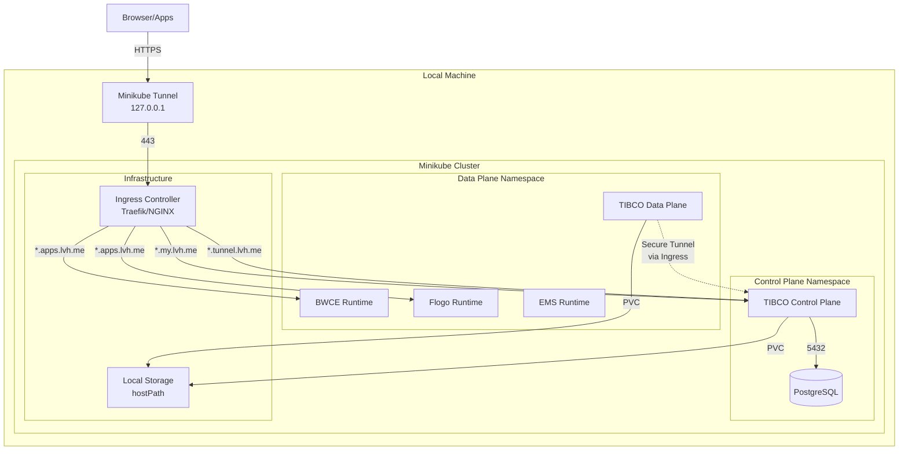

# TIBCO Platform Control Plane and Data Plane Setup on Minikube

**Document Purpose**: Complete step-by-step guide for deploying TIBCO Platform Control Plane and Data Plane on Minikube for local development and testing.

**Target Audience**: DevOps engineers, Platform administrators, Developers

**Prerequisites**: macOS or Linux system with at least 16GB RAM and 50GB free disk space

**Estimated Time**: 2-3 hours (first-time installation)

**Last Updated**: February 17, 2026

---

## Table of Contents

- [Overview](#overview)
- [Architecture](#architecture)
- [Part 1: Environment Preparation](#part-1-environment-preparation)
- [Part 2: Minikube Cluster Setup](#part-2-minikube-cluster-setup)
- [Part 3: Storage Configuration](#part-3-storage-configuration)
- [Part 4: Ingress Controller Setup](#part-4-ingress-controller-setup)
- [Part 5: PostgreSQL Database Setup](#part-5-postgresql-database-setup)
- [Part 6: DNS Configuration with lvh.me](#part-6-dns-configuration-with-lvhme)
- [Part 7: Certificate Management](#part-7-certificate-management)
  - [Step 7.7: Certificate Usage Reference](#step-77-certificate-usage-reference)
- [Part 8: Control Plane Deployment](#part-8-control-plane-deployment)
  - [Step 8.6: Initial Admin Login and Password Change](#step-86-initial-admin-login-and-password-change)
  - [Step 8.7: Create a Subscription](#step-87-create-a-subscription)
  - [Step 8.8: Configure User Permissions](#step-88-configure-user-permissions-in-subscription)
- [Part 9: Data Plane Deployment](#part-9-data-plane-deployment)
  - [Step 9.1: Create Data Plane Namespace and Secrets](#step-91-create-data-plane-namespace-and-secrets)
  - [Step 9.2: Register Data Plane in Control Plane UI](#step-92-register-data-plane-in-control-plane-ui)
- [Part 10: Post-Deployment Verification](#part-10-post-deployment-verification)
- [Part 11: Troubleshooting](#part-11-troubleshooting)

---

## Overview

This guide walks through deploying both TIBCO Platform Control Plane and Data Plane on a local Minikube cluster. This is ideal for development, testing, and learning purposes without requiring cloud infrastructure.

### What You Will Deploy

- **Minikube Kubernetes cluster** with appropriate resources
- **Storage Classes** using Minikube's built-in hostPath provisioner
- **Ingress Controller** (Traefik or NGINX)
- **PostgreSQL Database** (in-cluster)
- **TIBCO Platform Control Plane** (v1.14.0+)
- **TIBCO Platform Data Plane** with capabilities (BWCE, Flogo, EMS)

### Key Differences from Cloud Deployments

- **No DNS Service**: Uses lvh.me for automatic DNS resolution to localhost
- **Self-Signed Certificates**: Single wildcard certificate covering all domains
- **In-Cluster PostgreSQL**: No external database service
- **Local Storage**: Uses hostPath storage instead of cloud storage
- **LoadBalancer via Tunnel**: Uses `minikube tunnel` to expose services

### Communication Architecture

**Important**: Control Plane and Data Plane communicate via **secure tunnels over ingress URLs**:
- Data Plane connects to Control Plane's `my` domain (API endpoint)
- Data Plane establishes secure tunnel via Control Plane's `tunnel` domain
- BWCE and Flogo applications use ingress URLs for external access
- All traffic goes through the ingress controller

---

## Architecture



---

## Part 1: Environment Preparation

### Step 1.1: Install Required Tools

Ensure all required tools are installed on your local machine:

**For macOS:**

```bash
# Install Homebrew (if not already installed)
/bin/bash -c "$(curl -fsSL https://raw.githubusercontent.com/Homebrew/install/HEAD/install.sh)"

# Install required tools
brew install kubectl
brew install helm
brew install minikube
brew install openssl

# Verify installations
kubectl version --client
helm version
minikube version
openssl version
```

**For Linux:**

```bash
# Install kubectl
curl -LO "https://dl.k8s.io/release/$(curl -L -s https://dl.k8s.io/release/stable.txt)/bin/linux/amd64/kubectl"
sudo install -o root -g root -m 0755 kubectl /usr/local/bin/kubectl

# Install Helm
curl https://raw.githubusercontent.com/helm/helm/main/scripts/get-helm-3 | bash

# Install Minikube
curl -LO https://storage.googleapis.com/minikube/releases/latest/minikube-linux-amd64
sudo install minikube-linux-amd64 /usr/local/bin/minikube

# Verify installations
kubectl version --client
helm version
minikube version
openssl version
```

**Version Requirements:**
- kubectl: Latest stable version
- Helm: 3.17.0 or higher
- Minikube: 1.34.0 or higher
- OpenSSL: 1.1.1 or higher

### Step 1.2: Set Environment Variables

Navigate to the workshop directory and source environment variables:

```bash
# Navigate to the workshop directory
cd /Users/kul/git/tib/workshop-tp-minikube

# Source the environment variables
source scripts/minikube-env-variables.sh

# Verify variables are set
echo "Minikube Profile: $MINIKUBE_PROFILE"
echo "Control Plane MY Domain: $TP_CP_MY_DOMAIN"
echo "Control Plane TUNNEL Domain: $TP_CP_TUNNEL_DOMAIN"
echo "Data Plane Domain: $TP_DP_DOMAIN"
```

**Key Environment Variables** (configured in minikube-env-variables.sh):

```bash
# Minikube Configuration
export MINIKUBE_PROFILE="tibco-platform"
export MINIKUBE_DRIVER="docker"        # or "hyperkit" for macOS
export MINIKUBE_CPUS="6"
export MINIKUBE_MEMORY="16384"         # 16GB RAM
export MINIKUBE_DISK_SIZE="50g"

# The tunnel IP will be 127.0.0.1 when using minikube tunnel
export TUNNEL_IP="127.0.0.1"

# Control Plane Configuration
export TP_CP_INSTANCE_ID="cp1"
export TP_CP_NAMESPACE="${TP_CP_INSTANCE_ID}-ns"
export TP_CP_MY_DOMAIN="${TP_CP_INSTANCE_ID}-my.lvh.me"
export TP_CP_TUNNEL_DOMAIN="${TP_CP_INSTANCE_ID}-tunnel.lvh.me"

# Data Plane Configuration
export TP_DP_INSTANCE_ID="dp1"
export TP_DP_NAMESPACE="${TP_DP_INSTANCE_ID}-ns"
export TP_DP_DOMAIN="${TP_DP_INSTANCE_ID}-apps.lvh.me"

# Storage Configuration
export TP_DISK_STORAGE_CLASS="standard"
export TP_FILE_STORAGE_CLASS="standard"

# Database Configuration (In-Cluster PostgreSQL)
export POSTGRES_HOST="postgres-${TP_CP_INSTANCE_ID}-postgresql.${TP_CP_NAMESPACE}.svc.cluster.local"
export POSTGRES_PORT="5432"
export POSTGRES_DB="postgres"
export POSTGRES_USER="postgres"
export POSTGRES_PASSWORD="postgres123!"

# Container Registry (TIBCO JFrog)
export CONTAINER_REGISTRY_SERVER="csgprdeuwrepoedge.jfrog.io"
export CONTAINER_REGISTRY_USERNAME="your-username"
export CONTAINER_REGISTRY_PASSWORD="your-password"

# Helm Chart Repository
export TP_TIBCO_HELM_CHART_REPO="https://tibcosoftware.github.io/tp-helm-charts"
```

### Step 1.3: Create Environment Variables Script

The script will be created in [Part 2](#step-22-create-the-environment-variables-script).

---

## Part 2: Minikube Cluster Setup

### Step 2.1: Check System Resources

Before starting Minikube, ensure your system has sufficient resources:

```bash
# Check available memory (should have at least 16GB total)
# macOS
sysctl hw.memsize | awk '{print $2/1024/1024/1024 " GB"}'

# Linux
free -h

# Check available disk space (should have at least 50GB free)
df -h
```

### Step 2.2: Start Minikube Cluster

Start Minikube with appropriate resource allocation:

```bash
# Start Minikube cluster
minikube start \
  --profile ${MINIKUBE_PROFILE} \
  --driver ${MINIKUBE_DRIVER} \
  --cpus ${MINIKUBE_CPUS} \
  --memory ${MINIKUBE_MEMORY} \
  --disk-size ${MINIKUBE_DISK_SIZE} \
  --kubernetes-version=stable \
  --addons=storage-provisioner,default-storageclass,metrics-server

# Expected output:
# 😄  [tibco-platform] minikube v1.34.0 on Darwin 14.x
# ✨  Using the docker driver based on user configuration
# 👍  Starting control plane node tibco-platform in cluster tibco-platform
# 🚜  Pulling base image ...
# 🔥  Creating docker container (CPUs=6, Memory=16384MB) ...
# 🐳  Preparing Kubernetes v1.31.0 on Docker 27.2.0 ...
# 🔎  Verifying Kubernetes components...
# 🌟  Enabled addons: storage-provisioner, default-storageclass, metrics-server
# 🏄  Done! kubectl is now configured to use "tibco-platform" cluster
```

### Step 2.3: Verify Minikube Cluster

```bash
# Check cluster status
minikube status -p ${MINIKUBE_PROFILE}

# Expected output:
# tibco-platform
# type: Control Plane
# host: Running
# kubelet: Running
# apiserver: Running
# kubeconfig: Configured

# Check nodes
kubectl get nodes

# Expected output:
# NAME             STATUS   ROLES           AGE   VERSION
# tibco-platform   Ready    control-plane   2m    v1.31.0

# Check available resources
kubectl top node

# Check storage classes
kubectl get storageclass

# Expected output:
# NAME                 PROVISIONER                RECLAIMPOLICY   VOLUMEBINDINGMODE   ALLOWVOLUMEEXPANSION   AGE
# standard (default)   k8s.io/minikube-hostpath   Delete          Immediate           false                  2m
```

### Step 2.4: Start Minikube Tunnel (Required for LoadBalancer Services)

**Important**: Minikube tunnel is required to expose LoadBalancer services and make ingress work with a real IP address.

Open a **new terminal window** and run:

```bash
# Source environment variables in the new terminal
cd /Users/kul/git/tib/workshop-tp-minikube
source scripts/minikube-env-variables.sh

# Start the tunnel (requires sudo password)
minikube tunnel -p ${MINIKUBE_PROFILE}

# Expected output:
# ✅  Tunnel successfully started
# 
# 📌  NOTE: Please do not close this terminal as this process must stay alive for the tunnel to be accessible ...
# 
# ❗  The service/ingress requires privileged ports to be exposed: [80 443]
# 🔑  sudo permission will be asked for it.
# 
# 🏃  Starting tunnel for service traefik.
```

**Keep this terminal window open** throughout your work with the cluster. The tunnel must remain running for ingress to work.

**Verify Tunnel is Working:**

In your original terminal:

```bash
# Check that minikube tunnel is running
ps aux | grep "minikube tunnel"

# You should see the minikube tunnel process running
```

---

## Part 3: Storage Configuration

### Step 3.1: Verify Default Storage Class

Minikube comes with a default storage class that uses hostPath provisioner:

```bash
# Check storage classes
kubectl get storageclass

# Expected output:
# NAME                 PROVISIONER                RECLAIMPOLICY   VOLUMEBINDINGMODE   ALLOWVOLUMEEXPANSION   AGE
# standard (default)   k8s.io/minikube-hostpath   Delete          Immediate           false                  5m

# Describe the default storage class
kubectl describe storageclass standard
```

### Step 3.2: Test Storage Provisioning

Create a test PVC to verify storage works:

```bash
# Create test PVC
cat <<EOF | kubectl apply -f -
apiVersion: v1
kind: PersistentVolumeClaim
metadata:
  name: test-pvc
spec:
  accessModes:
    - ReadWriteOnce
  resources:
    requests:
      storage: 1Gi
EOF

# Verify PVC is bound
kubectl get pvc test-pvc

# Expected output:
# NAME       STATUS   VOLUME                                     CAPACITY   ACCESS MODES   STORAGECLASS   AGE
# test-pvc   Bound    pvc-xxxxxxxx-xxxx-xxxx-xxxx-xxxxxxxxxxxx   1Gi        RWO            standard       5s

# Clean up test PVC
kubectl delete pvc test-pvc
```

---

## Part 4: Ingress Controller Setup

### Option A: Traefik Ingress Controller (Recommended)

Traefik is the recommended ingress controller for TIBCO Platform v1.10.0+.

**Step 4.1: Add Traefik Helm Repository**

```bash
# Add Traefik Helm repository
helm repo add traefik https://traefik.github.io/charts
helm repo update

# Verify repository
helm search repo traefik/traefik
```

**Step 4.2: Install Traefik**

```bash
# Create traefik namespace
kubectl create namespace traefik

# Install Traefik with custom values
helm install traefik traefik/traefik \
  --namespace traefik \
  --version 32.2.0 \
  --set ports.web.port=80 \
  --set ports.websecure.port=443 \
  --set ports.websecure.tls.enabled=true \
  --set service.type=LoadBalancer \
  --set ingressClass.enabled=true \
  --set ingressClass.isDefaultClass=true

# Wait for Traefik to be ready
kubectl wait --namespace traefik \
  --for=condition=ready pod \
  --selector=app.kubernetes.io/name=traefik \
  --timeout=300s
```

**Step 4.3: Verify Traefik Installation**

```bash
# Check Traefik pods
kubectl get pods -n traefik

# Expected output:
# NAME                       READY   STATUS    RESTARTS   AGE
# traefik-xxxxxxxxxx-xxxxx   1/1     Running   0          1m

# Check Traefik service
kubectl get svc -n traefik

# Expected output (with minikube tunnel running):
# NAME      TYPE           CLUSTER-IP      EXTERNAL-IP   PORT(S)                      AGE
# traefik   LoadBalancer   10.96.xxx.xxx   127.0.0.1     80:30080/TCP,443:30443/TCP   1m

# Verify ingress class
kubectl get ingressclass

# Expected output:
# NAME      CONTROLLER                      PARAMETERS   AGE
# traefik   traefik.io/ingress-controller   <none>       1m
```

**Step 4.4: Get LoadBalancer IP**

```bash
# Get the external IP (should be 127.0.0.1 with minikube tunnel)
export INGRESS_IP=$(kubectl get svc traefik -n traefik -o jsonpath='{.status.loadBalancer.ingress[0].ip}')

echo "Ingress IP: $INGRESS_IP"

# Verify it matches expected tunnel IP
if [ "$INGRESS_IP" = "$TUNNEL_IP" ]; then
  echo "✅ Ingress IP matches expected tunnel IP (127.0.0.1)"
else
  echo "⚠️  Warning: Ingress IP ($INGRESS_IP) does not match expected tunnel IP ($TUNNEL_IP)"
  echo "⚠️  Make sure 'minikube tunnel' is running in a separate terminal"
fi
```

### Option B: NGINX Ingress Controller (Alternative)

> **Note**: NGINX ingress is deprecated from TIBCO Platform v1.10.0. Use Traefik instead.

If you still need to use NGINX:

```bash
# Enable NGINX ingress addon
minikube addons enable ingress -p ${MINIKUBE_PROFILE}

# Verify NGINX is running
kubectl get pods -n ingress-nginx

# Get LoadBalancer IP
export INGRESS_IP=$(kubectl get svc ingress-nginx-controller -n ingress-nginx -o jsonpath='{.status.loadBalancer.ingress[0].ip}')
```

---

## Part 5: PostgreSQL Database Setup

For Minikube, we'll deploy PostgreSQL in-cluster using the official TIBCO dp-config-aws chart (works for local deployments too).

### Step 5.1: Create Control Plane Namespace

```bash
# Create Control Plane namespace
kubectl create namespace ${TP_CP_NAMESPACE}

# Verify namespace
kubectl get namespace ${TP_CP_NAMESPACE}
```

### Step 5.2: Create Container Registry Secret

```bash
# Create docker registry secret for pulling TIBCO images
kubectl create secret docker-registry tibco-container-registry-credentials \
  --docker-server=${CONTAINER_REGISTRY_SERVER} \
  --docker-username=${CONTAINER_REGISTRY_USERNAME} \
  --docker-password=${CONTAINER_REGISTRY_PASSWORD} \
  --namespace ${TP_CP_NAMESPACE}

# Verify secret
kubectl get secret tibco-container-registry-credentials -n ${TP_CP_NAMESPACE}
```

### Step 5.3: Deploy PostgreSQL using Helm

```bash
# Add TIBCO Helm chart repository (if not already added)
helm repo add tibco-platform ${TP_TIBCO_HELM_CHART_REPO}
helm repo update

# Install PostgreSQL
helm upgrade --install --wait --timeout 10m --create-namespace \
  -n ${TP_CP_NAMESPACE} postgres-${TP_CP_INSTANCE_ID} dp-config-aws \
  --repo "${TP_TIBCO_HELM_CHART_REPO}" --version "^1.0.0" -f - <<EOF
global:
  tibco:
    containerRegistry:
      url: "${CONTAINER_REGISTRY_SERVER}"
      username: "${CONTAINER_REGISTRY_USERNAME}"
      password: "${CONTAINER_REGISTRY_PASSWORD}"
      repository: "tibco-platform-docker-prod"
  storageClass: ${TP_DISK_STORAGE_CLASS}

postgresql:
  enabled: true
  auth:
    postgresPassword: ${POSTGRES_PASSWORD}
    username: ${POSTGRES_USER}
    password: ${POSTGRES_PASSWORD}
    database: ${POSTGRES_DB}
  image:
    registry: "${CONTAINER_REGISTRY_SERVER}"
    repository: tibco-platform-docker-prod/common-postgresql
    tag: 16.4.0-debian-12-r14
    pullSecrets:
    - tibco-container-registry-credentials
  primary:
    resources:
      requests:
        cpu: "500m"
        memory: "1Gi"
      limits:
        cpu: "2"
        memory: "2Gi"
    persistence:
      size: 10Gi
      storageClass: ${TP_DISK_STORAGE_CLASS}
EOF
```

### Step 5.4: Verify PostgreSQL Deployment

```bash
# Check PostgreSQL pods
kubectl get pods -n ${TP_CP_NAMESPACE} | grep postgres

# Expected output:
# postgres-cp1-postgresql-0   1/1     Running   0          2m

# Check PostgreSQL service
kubectl get svc -n ${TP_CP_NAMESPACE} | grep postgres

# Expected output:
# postgres-cp1-postgresql             ClusterIP   10.96.xxx.xxx   <none>        5432/TCP   2m
# postgres-cp1-postgresql-hl          ClusterIP   None            <none>        5432/TCP   2m

# Check PostgreSQL PVC
kubectl get pvc -n ${TP_CP_NAMESPACE} | grep postgres

# Expected output:
# data-postgres-cp1-postgresql-0   Bound    pvc-xxx...   10Gi       RWO            standard   2m
```

### Step 5.5: Test PostgreSQL Connection

```bash
# Test connection from within the cluster
kubectl run postgresql-client --rm --tty -i --restart='Never' \
  --namespace ${TP_CP_NAMESPACE} \
  --image ${CONTAINER_REGISTRY_SERVER}/tibco-platform-docker-prod/common-postgresql:16.4.0-debian-12-r14 \
  --env="PGPASSWORD=${POSTGRES_PASSWORD}" \
  --command -- psql --host ${POSTGRES_HOST} -U ${POSTGRES_USER} -d ${POSTGRES_DB} -c "SELECT version();"

# Expected output:
# PostgreSQL 16.4 (Debian 16.4-1.pgdg120+1) on x86_64-pc-linux-gnu, compiled by gcc (Debian 12.2.0-14) 12.2.0, 64-bit
```

### Step 5.6: Create Required PostgreSQL Extensions

```bash
# Create extensions required by TIBCO Platform
kubectl run postgresql-client --rm --tty -i --restart='Never' \
  --namespace ${TP_CP_NAMESPACE} \
  --image ${CONTAINER_REGISTRY_SERVER}/tibco-platform-docker-prod/common-postgresql:16.4.0-debian-12-r14 \
  --env="PGPASSWORD=${POSTGRES_PASSWORD}" \
  --command -- psql --host ${POSTGRES_HOST} -U ${POSTGRES_USER} -d ${POSTGRES_DB} <<EOSQL
CREATE EXTENSION IF NOT EXISTS "uuid-ossp";
CREATE EXTENSION IF NOT EXISTS "pgcrypto";
SELECT * FROM pg_extension;
EOSQL

# Expected output showing the created extensions
```

---

## Part 6: DNS Configuration with lvh.me

Since Minikube doesn't have a DNS service, we'll use **lvh.me** for automatic DNS resolution. lvh.me automatically resolves all subdomains to `127.0.0.1`.

### Step 6.1: Understanding lvh.me

**What is lvh.me?**

[lvh.me](http://lvh.me) (short for "localhost me") is a free public DNS service that provides automatic wildcard DNS resolution to localhost (`127.0.0.1`). It's specifically designed for local development environments where you need multiple subdomains pointing to your local machine.

📚 **Documentation**: Visit [http://lvh.me](http://lvh.me) for more information

**How lvh.me Works:**

- `app.lvh.me` resolves to `127.0.0.1`
- `*.app.lvh.me` resolves to `127.0.0.1`
- `any.subdomain.lvh.me` resolves to `127.0.0.1`
- **No installation required** - it's a public DNS service that works immediately!
- **No configuration needed** - works out of the box on any machine with internet DNS access!

**Why Use lvh.me for Local Development?**

1. **Zero Configuration**: No need to edit `/etc/hosts` for every subdomain
2. **Wildcard Support**: Automatically supports unlimited subdomains
3. **No Local DNS Server**: Unlike dnsmasq, no local service to install or manage
4. **Cross-Platform**: Works on macOS, Linux, and Windows
5. **Internet Access**: Just requires standard DNS resolution (no special setup)
6. **Perfect for Development**: Mimics production multi-domain setups locally
7. **Clean FQDN Format**: Provides proper domain format for validation

**Why lvh.me instead of nip.io?**

TIBCO Platform's router component performs FQDN validation on domain names. The router rejects domains that contain IP-like patterns (e.g., `127.0.0.1`) within the domain name. 

- ❌ `account.cp1-my.127.0.0.1.nip.io` - **REJECTED** by router FQDN validation
- ✅ `account.cp1-my.lvh.me` - **ACCEPTED** by router FQDN validation

**Our DNS Strategy:**

Since minikube tunnel exposes services on `127.0.0.1`, all domains will be:

```
Control Plane MY:      *.cp1-my.lvh.me       → 127.0.0.1
Control Plane TUNNEL:  *.cp1-tunnel.lvh.me   → 127.0.0.1
Data Plane Apps:       *.dp1-apps.lvh.me     → 127.0.0.1
```

### Step 6.2: Verify DNS Resolution

```bash
# Test DNS resolution
nslookup account.${TP_CP_MY_DOMAIN}
nslookup tunnel.${TP_CP_TUNNEL_DOMAIN}
nslookup myapp.${TP_DP_DOMAIN}

# All should resolve to 127.0.0.1

# Test with dig (alternative)
dig +short account.${TP_CP_MY_DOMAIN}
# Should return: 127.0.0.1

# Test with curl (should get connection refused, which is expected at this point)
curl -k https://account.${TP_CP_MY_DOMAIN} -v

# You should see:
# * Trying 127.0.0.1:443...
# * connect to 127.0.0.1 port 443 failed: Connection refused
# (This is expected - ingress will handle these once deployed)
```

### Step 6.3: Alternative DNS Options

If lvh.me is blocked or doesn't work in your network:

**Option A: /etc/hosts (Manual DNS - Most Reliable)**

```bash
# Edit /etc/hosts (requires sudo)
sudo tee -a /etc/hosts <<EOF
127.0.0.1 account.cp1-my.local admin.cp1-my.local
127.0.0.1 apiauth.cp1-my.local platform.cp1-my.local
127.0.0.1 tunnel.cp1-tunnel.local hybridproxy.cp1-tunnel.local
127.0.0.1 myapp.dp1-apps.local
EOF

# Update environment variables
export TP_CP_MY_DOMAIN="cp1-my.local"
export TP_CP_TUNNEL_DOMAIN="cp1-tunnel.local"
export TP_DP_DOMAIN="dp1-apps.local"
```

**Option B: sslip.io (Alternative DNS Service)**

Note: sslip.io uses dashes instead of dots for IP addresses to avoid FQDN validation issues.

```bash
# Won't work with TIBCO router (IP pattern in domain)
# export TP_CP_MY_DOMAIN="${TP_CP_INSTANCE_ID}-my.127-0-0-1.sslip.io"

# Better: Use /etc/hosts or stay with lvh.me
```

**Important**: If you use alternative DNS, you'll also need to update:
- Certificate generation script SANs
- Control Plane Helm values
- Data Plane configuration

---

## Part 7: Certificate Management

For Minikube, we'll create a single wildcard self-signed certificate that covers all domains with appropriate SANs.

### Step 7.1: Understanding Certificate Requirements

TIBCO Platform requires TLS certificates for:

1. **Control Plane MY Domain**: `*.cp1-my.lvh.me` (e.g., account.cp1-my.lvh.me, admin.cp1-my.lvh.me)
2. **Control Plane TUNNEL Domain**: `*.cp1-tunnel.lvh.me` (e.g., tunnel.cp1-tunnel.lvh.me)
3. **Hybrid Proxy URLs** (if using hybrid connectivity)
4. **Data Plane App URLs**: `*.dp1-apps.lvh.me` (e.g., myapp.dp1-apps.lvh.me)

**Certificate Strategy for Minikube:**

We'll create a single certificate with multiple SAN entries covering all domains, or create separate certificates for MY and TUNNEL domains.

### Step 7.2: Generate Certificates Using the Script

```bash
# Make sure you're in the workshop directory
cd /Users/kul/git/tib/workshop-tp-minikube

# Source environment variables (if not already done)
source scripts/minikube-env-variables.sh

# Run the certificate generation script
./scripts/generate-certificates-minikube.sh

# The script will:
# 1. Create certificates for MY domain with appropriate SANs
# 2. Create certificates for TUNNEL domain with appropriate SANs
# 3. Create a combined certificate for ingress (optional)
# 4. Output Kubernetes secret creation commands
```

### Step 7.3: Review Generated Certificates

```bash
# List generated certificates
ls -la certs/

# Expected output:
# cp-my-cert.pem         - MY domain certificate
# cp-my-key.pem          - MY domain private key
# cp-tunnel-cert.pem     - TUNNEL domain certificate
# cp-tunnel-key.pem      - TUNNEL domain private key
# combined-cert.pem      - Combined certificate for ingress (all SANs)
# combined-key.pem       - Combined certificate private key

# Verify certificate SANs
openssl x509 -in certs/combined-cert.pem -noout -text | grep -A 20 "Subject Alternative Name"

# Expected SANs:
# DNS:*.cp1-my.lvh.me
# DNS:cp1-my.lvh.me
# DNS:*.cp1-tunnel.lvh.me
# DNS:cp1-tunnel.lvh.me
# DNS:*.dp1-apps.lvh.me
# DNS:dp1-apps.lvh.me
# DNS:admin.cp1-my.lvh.me
# DNS:account.cp1-my.lvh.me
# DNS:platform.cp1-my.lvh.me
# DNS:hybridproxy.cp1-my.lvh.me
# DNS:hybridproxy.cp1-tunnel.lvh.me
# DNS:localhost
# IP:127.0.0.1
```

### Step 7.4: Create Kubernetes TLS Secrets

**For Control Plane (cp1-ns namespace):**

```bash
# Create TLS secret for MY domain in Control Plane namespace
kubectl create secret tls tp-certificate-my \
  --cert=certs/cp-my-cert.pem \
  --key=certs/cp-my-key.pem \
  -n ${TP_CP_NAMESPACE}

# Create TLS secret for TUNNEL domain in Control Plane namespace
kubectl create secret tls tp-certificate-tunnel \
  --cert=certs/cp-tunnel-cert.pem \
  --key=certs/cp-tunnel-key.pem \
  -n ${TP_CP_NAMESPACE}

# Verify secrets
kubectl get secrets -n ${TP_CP_NAMESPACE} | grep tp-certificate

# Expected output:
# tp-certificate-my      kubernetes.io/tls   2      5s
# tp-certificate-tunnel  kubernetes.io/tls   2      5s
```

**Certificate Purpose Summary:**
- `tp-certificate-my`: Used by router-operator ingress for `*.cp1-my.lvh.me` domains (admin console, platform UI, APIs)
- `tp-certificate-tunnel`: Used by hybrid-proxy ingress for `*.cp1-tunnel.lvh.me` domains (tunnel connections)
- `ca-cert.pem`: Root CA certificate (will be used for Data Plane trust - see Part 9)

### Step 7.5: Create Default Certificate for Ingress (Optional)

If using Traefik, you can create a default certificate:

```bash
# Create TLS secret in traefik namespace for default certificate
kubectl create secret tls default-tls-cert \
  --cert=certs/combined-cert.pem \
  --key=certs/combined-key.pem \
  -n traefik

# Verify secret
kubectl get secret default-tls-cert -n traefik
```

### Step 7.6: Trust Self-Signed CA (Optional - for Browser Access)

To avoid browser security warnings, you can add the CA certificate to your system's trust store:

**For macOS:**

```bash
# Import CA certificate to system keychain
sudo security add-trusted-cert -d -r trustRoot -k /Library/Keychains/System.keychain certs/ca-cert.pem

# Verify
security find-certificate -c "TIBCO Platform CA" -a
```

**For Linux:**

```bash
# Copy CA certificate to trusted certificates directory
sudo cp certs/ca-cert.pem /usr/local/share/ca-certificates/tibco-platform-ca.crt

# Update CA certificates
sudo update-ca-certificates

# Verify
ls -la /etc/ssl/certs | grep tibco
```

### Step 7.7: Certificate Usage Reference

This section provides a complete reference of all certificates generated and where they are used in the TIBCO Platform deployment.

**📋 Certificate Files Generated:**

| File Name | Type | Purpose | Used By |
|-----------|------|---------|---------|
| `ca-cert.pem` | CA Certificate | Root Certificate Authority | Signs all other certificates, trusted by Data Plane |
| `ca-key.pem` | CA Private Key | CA signing key | Certificate generation only (keep secure!) |
| `cp-my-cert.pem` | Server Certificate | Control Plane MY domain TLS | Ingress for `*.cp1-my.lvh.me` |
| `cp-my-key.pem` | Private Key | MY domain signing key | Ingress for `*.cp1-my.lvh.me` |
| `cp-tunnel-cert.pem` | Server Certificate | Control Plane TUNNEL domain TLS | Ingress for `*.cp1-tunnel.lvh.me` |
| `cp-tunnel-key.pem` | Private Key | TUNNEL domain signing key | Ingress for `*.cp1-tunnel.lvh.me` |
| `combined-cert.pem` | Server Certificate | All domains combined | Optional: default ingress certificate |
| `combined-key.pem` | Private Key | Combined signing key | Optional: default ingress certificate |

**🔐 Kubernetes Secrets Created:**

| Secret Name | Namespace | Type | Contains | Used By |
|-------------|-----------|------|----------|---------|
| `tp-certificate-my` | `cp1-ns` | `kubernetes.io/tls` | cp-my-cert.pem + key | Router-operator ingress |
| `tp-certificate-tunnel` | `cp1-ns` | `kubernetes.io/tls` | cp-tunnel-cert.pem + key | Hybrid-proxy ingress |
| `dp-trusted-ca-certificate` | `dp1-ns` | `Opaque` | ca-cert.pem | Data Plane trust configuration |
| `default-tls-cert` | `traefik` | `kubernetes.io/tls` | combined-cert.pem + key | Traefik default certificate (optional) |

**🌐 Certificate to Domain Mapping:**

```
CA Certificate (ca-cert.pem)
│
├─ Signs: cp-my-cert.pem
│  └─ Covers domains:
│     ├─ *.cp1-my.lvh.me (wildcard)
│     ├─ admin.cp1-my.lvh.me (Admin Console)
│     ├─ account.cp1-my.lvh.me (Account Management)
│     ├─ platform.cp1-my.lvh.me (Platform UI)
│     ├─ benelux.cp1-my.lvh.me (Subscription - example)
│     └─ All other Control Plane services
│
└─ Signs: cp-tunnel-cert.pem
   └─ Covers domains:
      ├─ *.cp1-tunnel.lvh.me (wildcard)
      ├─ tunnel.cp1-tunnel.lvh.me (Tunnel endpoint)
      └─ hybridproxy.cp1-tunnel.lvh.me (Hybrid connectivity)
```

**🔄 Certificate Flow in Deployment:**

```
1. Certificate Generation (Part 7, Step 7.2)
   ./scripts/generate-certificates-minikube.sh
   ↓
   Creates all certificate files in certs/ directory

2. Control Plane Secrets (Part 7, Step 7.4)
   kubectl create secret tls tp-certificate-my -n cp1-ns
   kubectl create secret tls tp-certificate-tunnel -n cp1-ns
   ↓
   Ingress resources reference these secrets for TLS termination

3. Data Plane Trust Secret (Part 9, Step 9.1)
   kubectl create secret generic dp-trusted-ca-certificate -n dp1-ns
   ↓
   Data Plane uses ca-cert.pem to trust Control Plane connections

4. Traefik Default Certificate (Part 7, Step 7.5 - Optional)
   kubectl create secret tls default-tls-cert -n traefik
   ↓
   Fallback certificate for any domain not specifically configured
```

**🎯 When to Use Each Certificate:**

| Scenario | Certificate/Secret | Reason |
|----------|-------------------|--------|
| **Control Plane MY domain ingress** | `tp-certificate-my` | Secures admin, account, platform, subscription URLs |
| **Control Plane TUNNEL domain ingress** | `tp-certificate-tunnel` | Secures tunnel and hybrid proxy connections |
| **Data Plane trusting Control Plane** | `dp-trusted-ca-certificate` (contains ca-cert.pem) | Data Plane validates CP certificate authenticity |
| **Browser access without warnings** | Import `ca-cert.pem` to system trust store | Browser trusts all certificates signed by this CA |
| **Traefik default/fallback** | `default-tls-cert` | Handles any domain not explicitly configured |

**⚠️ Security Notes:**

1. **Keep `ca-key.pem` secure**: This can sign new certificates trusted by your deployment
2. **Certificate Validity**: Generated certificates are valid for 365 days (can be adjusted in script)
3. **Production Use**: For production, use certificates from a trusted CA (Let's Encrypt, DigiCert, etc.)
4. **Certificate Rotation**: To rotate certificates, regenerate them and update the secrets:
   ```bash
   # Regenerate certificates
   ./scripts/generate-certificates-minikube.sh
   
   # Update Control Plane secrets
   kubectl delete secret tp-certificate-my -n cp1-ns
   kubectl delete secret tp-certificate-tunnel -n cp1-ns
   
   # Recreate with new certificates
   kubectl create secret tls tp-certificate-my --cert=certs/cp-my-cert.pem --key=certs/cp-my-key.pem -n cp1-ns
   kubectl create secret tls tp-certificate-tunnel --cert=certs/cp-tunnel-cert.pem --key=certs/cp-tunnel-key.pem -n cp1-ns
   
   # Update Data Plane CA trust secret
   kubectl delete secret dp-trusted-ca-certificate -n dp1-ns
   kubectl create secret generic dp-trusted-ca-certificate --from-file=ca.crt=./certs/ca-cert.pem -n dp1-ns
   
   # Restart pods to pick up new certificates
   kubectl rollout restart deployment -n cp1-ns
   kubectl rollout restart deployment -n dp1-ns
   ```

**📚 Additional Resources:**

- [TIBCO Platform Documentation - Custom Certificates](https://docs.tibco.com/pub/platform-cp/1.14.0/doc/html/Default.htm#UserGuide/using-custom-certificate.htm)
- [Certificate generation script](../scripts/generate-certificates-minikube.sh)
- [OpenSSL Certificate Guide](https://www.openssl.org/docs/man1.1.1/man1/openssl-x509.html)

---

## Part 8: Control Plane Deployment

### Step 8.1: Understanding Router DNS Configuration

**IMPORTANT**: TIBCO Platform's router component validates domain FQDNs. To use lvh.me domains, we must configure the router to accept `.lvh.me` domains.

The router uses two configuration settings:
1. **VALID_TIBCO_DOMAINS**: Whitelist of allowed domain suffixes
2. **SUPPORTED_DOMAINS_REGEX**: Regex pattern for domain validation

Without these settings, the router will reject all routes and the Control Plane will be  inaccessible!

### Step 8.2: Prepare Control Plane Values

Create a values file for Control Plane deployment with router configuration:

```bash
cat > cp-values.yaml <<EOF
# Router DNS configuration (CRITICAL for lvh.me domains)
tp-cp-configuration:
  settings:
    - name: infra.router.valid.tibco.domains
      value: ".lvh.me"
    - name: infra.router.supported.domains.regex
      value: "([^.]+\\\\.lvh\\\\.me)"

global:
  tibco:
    containerRegistry:
      url: "${CONTAINER_REGISTRY_SERVER}"
      username: "${CONTAINER_REGISTRY_USERNAME}"
      password: "${CONTAINER_REGISTRY_PASSWORD}"
      repository: "tibco-platform-docker-prod"
    serviceAccount: "${TP_CP_INSTANCE_ID}-sa"
    controlPlaneInstanceId: "${TP_CP_INSTANCE_ID}"
    
  external:
    ingress:
      ingressClassName: "traefik"
      
    db_host: "${POSTGRES_HOST}"
    db_port: ${POSTGRES_PORT}
    db_username: "${POSTGRES_USER}"
    db_password: "${POSTGRES_PASSWORD}"
    db_name: "${POSTGRES_DB}"
    
    dnsDomain: "${TP_CP_MY_DOMAIN}"
    dnsTunnelDomain: "${TP_CP_TUNNEL_DOMAIN}"
    
    storage:
      storageClassName: "${TP_DISK_STORAGE_CLASS}"
      fileStorageClassName: "${TP_FILE_STORAGE_CLASS}"

# Control Plane specific configurations
tp-cp-core:
  enabled: true
  
tp-cp-integration:
  enabled: true
  
tp-cp-web:
  enabled: true

# TLS configuration
ingress:
  tls:
    - secretName: tp-certificate-my
      hosts:
        - "*.${TP_CP_MY_DOMAIN}"
    - secretName: tp-certificate-tunnel
      hosts:
        - "*.${TP_CP_TUNNEL_DOMAIN}"
EOF

echo "✅ Control Plane values file created: cp-values.yaml"
```

### Step 8.3: Deploy Control Plane

```bash
# Add TIBCO Platform Helm repository (if not already added)
helm repo add tibco-platform ${TP_TIBCO_HELM_CHART_REPO}
helm repo update

# Install Control Plane
helm upgrade --install --wait --timeout 30m \
  -n ${TP_CP_NAMESPACE} \
  ${TP_CP_INSTANCE_ID} \
  tibco-platform/tp-cp \
  --version "^1.3.0" \
  -f cp-values.yaml

# Note: This may take 15-30 minutes depending on your system
```

### Step 8.3: Monitor Control Plane Deployment

```bash
# Watch pods being created
kubectl get pods -n ${TP_CP_NAMESPACE} -w

# Check deployment status
helm status ${TP_CP_INSTANCE_ID} -n ${TP_CP_NAMESPACE}

# Check all pods are running (may take 15-20 minutes)
kubectl get pods -n ${TP_CP_NAMESPACE}

# Expected output (all pods should be Running):
# NAME                                          READY   STATUS    RESTARTS   AGE
# postgres-cp1-postgresql-0                      1/1     Running   0          30m
# tp-cp-web-xxxxxxxxxx-xxxxx                     1/1     Running   0          10m
# tp-cp-proxy-xxxxxxxxxx-xxxxx                   1/1     Running   0          10m
# tp-cp-core-xxxxxxxxxx-xxxxx                    1/1     Running   0          10m
# ... (more pods)
```

### Step 8.4: Get Control Plane Admin Password

```bash
# Get the initial admin password
export TP_CP_ADMIN_PASSWORD=$(kubectl get secret -n ${TP_CP_NAMESPACE} \
  ${TP_CP_INSTANCE_ID}-admin-secret \
  -o jsonpath='{.data.password}' | base64 -d)

echo "Control Plane Admin Password: ${TP_CP_ADMIN_PASSWORD}"

# Save credentials to a secure location
cat > cp-credentials.txt <<EOF
Control Plane Access Information
=================================
URL: https://account.${TP_CP_MY_DOMAIN}
Username: admin
Password: ${TP_CP_ADMIN_PASSWORD}

Platform URL: https://platform.${TP_CP_MY_DOMAIN}
API URL: https://apiauth.${TP_CP_MY_DOMAIN}
Tunnel URL: https://tunnel.${TP_CP_TUNNEL_DOMAIN}
EOF

echo "✅ Credentials saved to: cp-credentials.txt"
cat cp-credentials.txt
```

### Step 8.5: Verify Control Plane Access

```bash
# Check Control Plane ingress
kubectl get ingress -n ${TP_CP_NAMESPACE}

# Test Control Plane web interface
curl -k https://account.${TP_CP_MY_DOMAIN} -I

# Expected output:
# HTTP/1.1 200 OK
# (or HTTP/1.1 302 Found for redirect)

# Open Control Plane in browser
echo "Open the following URL in your browser:"
echo "https://account.${TP_CP_MY_DOMAIN}"
echo ""
echo "Login with:"
echo "  Username: admin"
echo "  Password: ${TP_CP_ADMIN_PASSWORD}"
```

**Note**: Because we're using self-signed certificates, your browser will show a security warning. Click "Advanced" and "Proceed to site" (or equivalent for your browser).

### Step 8.6: Initial Admin Login and Password Change

**Important**: On first login, you must change the initial password.

```bash
# Get admin credentials
cat cp-credentials.txt

# Note the initial password
echo "Initial Admin Password: ${TP_CP_ADMIN_PASSWORD}"
```

**Login Process:**

1. Open the admin console in your browser:
   ```
   https://admin.${TP_CP_MY_DOMAIN}
   ```
   Example: https://admin.cp1-my.lvh.me

2. Accept the self-signed certificate warning

3. Login with:
   - **Username**: `admin`
   - **Password**: (from cp-credentials.txt)

4. **Change Password**: You will be prompted to change the initial password
   - Enter a new secure password
   - Confirm the new password
   - Click "Change Password"

5. **If the page crashes or shows an error**: This is normal! The session may be invalidated after password change.
   - Simply go back to the same URL: `https://admin.${TP_CP_MY_DOMAIN}`
   - Login with username `admin` and your **NEW password**

**Save your new password securely!**

### Step 8.7: Create a Subscription

A subscription in TIBCO Platform is a tenant workspace where you can manage capabilities, users, and applications.

**Steps to Create a Subscription:**

1. After logging in as admin, navigate to the **Subscriptions** page

2. Click **"+ Create Subscription"**

3. Fill in the subscription details:
   - **Subscription Name**: `Benelux` (or any name you prefer)
   - **Host Prefix**: `benelux` (lowercase, no spaces - this becomes part of the URL)
   - **Description**: `Benelux Development Environment` (optional)
   - **Region**: Select your region

4. Click **"Create"**

5. Wait for the subscription to be created (should take 1-2 minutes)

**Access the Subscription:**

Once created, you can access your subscription at:
```
https://benelux.${TP_CP_MY_DOMAIN}
```
Example: https://benelux.cp1-my.lvh.me

**Important URL Pattern:**
- Admin Console: `https://admin.${TP_CP_MY_DOMAIN}`
- Subscription: `https://{host-prefix}.${TP_CP_MY_DOMAIN}`
- Account Management: `https://account.${TP_CP_MY_DOMAIN}`

### Step 8.8: Configure User Permissions in Subscription

After creating the subscription, configure admin user permissions:

1. **Login to your subscription**:
   ```
   https://benelux.${TP_CP_MY_DOMAIN}
   ```
   Use the same admin credentials (with new password)

2. **Navigate to User Management**:
   - Click on your profile icon (top right)
   - Select **"Settings"** or **"Administration"**
   - Go to **"User Management"** → **"Users"**

3. **Grant Permissions to Admin User**:
   - Find the `admin` user in the list
   - Click on the user to edit
   - Under **"Roles"** or **"Permissions"**, select:
     - ✅ **Subscription Administrator**
     - ✅ **Data Plane Administrator**
     - ✅ **Capability Administrator**
     - ✅ **User Administrator**
     - ✅ **Developer**
   - Click **"Save"**

4. **Verify Permissions**:
   - Logout and login again
   - You should now see all management options in the sidebar/menu

---

## Part 9: Data Plane Deployment

### Overview

The Data Plane runs your workloads and applications. It connects back to the Control Plane for management and orchestration. Before deploying, we need to:
1. Create the Data Plane namespace
2. Create required secrets (registry credentials and CA certificate)
3. Register the Data Plane in Control Plane UI
4. Deploy the Data Plane using Helm

### Step 9.1: Create Data Plane Namespace and Secrets

**Create the namespace:**

```bash
# Create Data Plane namespace
kubectl create namespace ${TP_DP_NAMESPACE}
```

**Create container registry credentials:**

```bash
# Create container registry secret in Data Plane namespace
source scripts/.credentials
kubectl create secret docker-registry tibco-container-registry-credentials \
  --docker-server=csgprdeuwrepoedge.jfrog.io \
  --docker-username="${TP_CONTAINER_REGISTRY_USER}" \
  --docker-password="${TP_CONTAINER_REGISTRY_PASSWORD}" \
  --namespace ${TP_DP_NAMESPACE}
```

**Create CA certificate trust secret:**

⚠️ **CRITICAL**: The Data Plane must trust the Control Plane's TLS certificate. Since we're using self-signed certificates, we need to provide the CA certificate to the Data Plane.

```bash
# Create secret with CA certificate for Data Plane to trust Control Plane
kubectl create secret generic dp-trusted-ca-certificate \
  --from-file=ca.crt=./certs/ca-cert.pem \
  -n ${TP_DP_NAMESPACE}

# Verify the secret was created
kubectl get secret dp-trusted-ca-certificate -n ${TP_DP_NAMESPACE}
```

**What is dp-trusted-ca-certificate?**

This secret contains the Certificate Authority (CA) certificate that signed the Control Plane's TLS certificates. The Data Plane needs this to:
- Verify the Control Plane's TLS certificate during HTTPS connections
- Establish secure communication with the Control Plane
- Trust the tunnel endpoint for hybrid connectivity

**Certificate Trust Chain:**
```
ca-cert.pem (Root CA)
    |
    +-- Signs --> cp-my-cert.pem (Control Plane MY domain)
    |
    +-- Signs --> cp-tunnel-cert.pem (Control Plane TUNNEL domain)
```

When the Data Plane connects to `https://platform.cp1-my.lvh.me`, it will:
1. Receive the `cp-my-cert.pem` certificate from the server
2. Check if it's signed by a trusted CA
3. Find `ca-cert.pem` in the `dp-trusted-ca-certificate` secret
4. Verify the signature and establish trust

**Verify all secrets are created:**

```bash
kubectl get secrets -n ${TP_DP_NAMESPACE}

# Expected output:
# NAME                                   TYPE                             DATA   AGE
# dp-trusted-ca-certificate              Opaque                           1      10s
# tibco-container-registry-credentials   kubernetes.io/dockerconfigjson   1      30s
```

### Step 9.2: Register Data Plane in Control Plane UI

**Prerequisites:**
- Admin user with Data Plane Administrator permissions (completed in Step 8.8)
- Subscription created (e.g., "benelux")

**Steps to Register Data Plane:**

1. **Login to your subscription**:
   ```
   https://benelux.${TP_CP_MY_DOMAIN}
   ```
   Example: https://benelux.cp1-my.lvh.me

2. **Navigate to Data Planes**:
   - In the left sidebar, click **"Data Planes"** or **"Infrastructure"**
   - Click **"+ Add Data Plane"** or **"Register Data Plane"**

3. **Fill in Data Plane Details**:
   - **Data Plane Name**: `dp1`
   - **Display Name**: `Minikube Data Plane`
   - **Description**: `Local development Data Plane on Minikube`
   - **Environment**: `development` (or create a custom environment)
   - **Region**: Select your region (or leave default)
   - **Kubernetes Cluster Name**: `minikube-tp`

4. **Custom Certificate Configuration**:
   
   ⚠️ **IMPORTANT**: Since we're using self-signed certificates, you MUST configure the custom certificate.
   
   - **Scroll down to "Advanced Settings" or "Certificate Settings"**
   - Look for **"Custom CA Certificate"** or **"Trusted CA Certificate"**
   - **Enable** custom certificate option
   - **Specify Secret Name**: `dp-trusted-ca-certificate`
   
   This tells the Data Plane to use the secret we created in Step 9.1 to trust the Control Plane's certificate.
   
   📚 **Reference**: [TIBCO Platform - Using Custom Certificates](https://docs.tibco.com/pub/platform-cp/1.14.0/doc/html/Default.htm#UserGuide/using-custom-certificate.htm)

5. **Click "Create" or "Register"**

6. **Download Bootstrap Configuration**:
   - After creation, you'll see a **"Download Configuration"** button
   - Click it to download the `dp-bootstrap.json` file
   - **OR** copy the bootstrap token/configuration displayed on screen

**Save the bootstrap configuration** - you'll need it in the next step!

### Step 9.3: Deploy Data Plane Using Generated Commands

After registering the Data Plane in Step 9.2, the Control Plane UI will display deployment commands. **Important**: Click the **"Done"** button to finalize the registration.

**The Control Plane generates three deployment commands:**

#### Command 1: Add Helm Repository (if not already added)

```bash
helm repo add tibco-platform-public https://tibcosoftware.github.io/tp-helm-charts
helm repo update tibco-platform-public
```

**Expected output:**
```
"tibco-platform-public" already exists with the same configuration, skipping
Hang tight while we grab the latest from your chart repositories...
...Successfully got an update from the "tibco-platform-public" chart repository
Update Complete. ⎈Happy Helming!⎈
```

#### Command 2: Label the Namespace with Data Plane ID

The Control Plane will show a command like this (with your specific Data Plane ID):

```bash
kubectl apply -f - <<EOF
apiVersion: v1
kind: Namespace
metadata:
  name: dp1-ns
  labels:
    platform.tibco.com/dataplane-id: d6a91t1522pc73cg66r0  # Your actual ID
EOF
```

**What this does:**
- Adds a label to the namespace linking it to the registered Data Plane
- The Control Plane uses this label to identify and manage the Data Plane

**Expected output:**
```
Warning: resource namespaces/dp1-ns is missing the kubectl.kubernetes.io/last-applied-configuration annotation...
namespace/dp1-ns configured
```

**Note**: The warning is normal since we created the namespace earlier with `kubectl create` instead of `kubectl apply`.

**Verify the label:**
```bash
kubectl get namespace dp1-ns -o yaml | grep -A 3 "labels:"

# Expected output should include:
# labels:
#   platform.tibco.com/dataplane-id: d6a91t1522pc73cg66r0
```

#### Command 3: Install dp-configure-namespace Chart

This chart configures the namespace with necessary service accounts and RBAC:

```bash
# Source credentials for container registry
source scripts/.credentials

# Install dp-configure-namespace (use the exact command from CP UI)
helm upgrade --install -n dp1-ns dp-configure-namespace \
  tibco-platform-public/dp-configure-namespace \
  --version 1.14.1 \
  --set global.tibco.dataPlaneId=<YOUR_DATAPLANE_ID> \
  --set global.tibco.subscriptionId=<YOUR_SUBSCRIPTION_ID> \
  --set global.tibco.primaryNamespaceName=dp1-ns \
  --set global.tibco.serviceAccount=dp1sa \
  --set global.tibco.containerRegistry.url=csgprdeuwrepoedge.jfrog.io \
  --set global.tibco.containerRegistry.username="${TP_CONTAINER_REGISTRY_USER}" \
  --set global.tibco.containerRegistry.password="${TP_CONTAINER_REGISTRY_PASSWORD}" \
  --set global.tibco.containerRegistry.repository=tibco-platform-docker-prod \
  --set global.tibco.enableClusterScopedPerm=true \
  --set networkPolicy.createDeprecatedPolicies=false
```

**Important**: Replace `<YOUR_DATAPLANE_ID>` and `<YOUR_SUBSCRIPTION_ID>` with the values from the UI.

**Expected output:**
```
Release "dp-configure-namespace" does not exist. Installing it now.
NAME: dp-configure-namespace
LAST DEPLOYED: Tue Feb 17 17:02:52 2026
NAMESPACE: dp1-ns
STATUS: deployed
REVISION: 1
DESCRIPTION: Install complete
```

**What this chart creates:**
- Service account `dp1sa` for Data Plane pods
- RBAC roles and role bindings
- Container registry secret
- Network policies (if enabled)

#### Command 4: Install dp-core-infrastructure Chart

This is the main Data Plane infrastructure including the tunnel connection:

```bash
helm upgrade --install dp-core-infrastructure -n dp1-ns \
  tibco-platform-public/dp-core-infrastructure \
  --version 1.14.2 \
  --set global.tibco.dataPlaneId=<YOUR_DATAPLANE_ID> \
  --set global.tibco.subscriptionId=<YOUR_SUBSCRIPTION_ID> \
  --set tp-tibtunnel.configure.accessKey=<GENERATED_ACCESS_KEY> \
  --set tp-tibtunnel.connect.url=https://benelux.cp1-tunnel.lvh.me/sub-<SUB_ID>-dp-<DP_ID> \
  --set global.tibco.serviceAccount=dp1sa \
  --set global.tibco.containerRegistry.url=csgprdeuwrepoedge.jfrog.io \
  --set global.tibco.containerRegistry.repository=tibco-platform-docker-prod \
  --set global.proxy.noProxy='' \
  --set global.tibco.cpCertificateSecret=dp-trusted-ca-certificate \
  --set global.logging.fluentbit.enabled=true
```

**🔑 Critical Parameters:**

- `tp-tibtunnel.configure.accessKey`: Secure access key generated by Control Plane
- `tp-tibtunnel.connect.url`: Tunnel endpoint URL (includes subscription and dataplane IDs)
- `global.tibco.cpCertificateSecret`: **dp-trusted-ca-certificate** - the CA certificate secret we created in Step 9.1!
- `global.logging.fluentbit.enabled=true`: Enables log collection

**Expected output:**
```
Release "dp-core-infrastructure" does not exist. Installing it now.
NAME: dp-core-infrastructure
LAST DEPLOYED: Tue Feb 17 17:03:00 2026
NAMESPACE: dp1-ns
STATUS: deployed
REVISION: 1
DESCRIPTION: Install complete
TEST SUITE: None
NOTES:
TIBCO Platform Data Plane Infrastructure.
```

**What this chart deploys:**
- `tp-tibtunnel`: Secure tunnel connection to Control Plane
- `msg-ems-tp`: Enterprise Message Service (if enabled)
- `dp-config-orchestrator`: Configuration management
- Monitoring and logging components

### Step 9.4: Monitor Data Plane Deployment

```bash
# Watch pods being created
kubectl get pods -n ${TP_DP_NAMESPACE} -w

# Check all pods are running
kubectl get pods -n ${TP_DP_NAMESPACE}

# Expected output:
# NAME                                    READY   STATUS    RESTARTS   AGE
# tp-dp-core-xxxxxxxxxx-xxxxx              1/1     Running   0          10m
# bwprovisioner-xxxxxxxxxx-xxxxx           1/1     Running   0          10m
# flogoprovisioner-xxxxxxxxxx-xxxxx        1/1     Running   0          10m
```

### Step 9.5: Verify Data Plane Connection to Control Plane

**Check tp-tibtunnel logs for successful connection:**

```bash
# Check tunnel connection status
kubectl logs -n dp1-ns -l app.kubernetes.io/name=tp-tibtunnel -c tibtunnel --tail=100

# Look for successful connection messages:
# {"level":"info","msg":"Starting health check API on :3127","time":"..."}
# {"level":"info","msg":"tibtunnel(proxy): (TT) client connected","time":"..."}
# {"level":"info","msg":"tibtunnel(proxy): (T) tunnel created (WS connection)","time":"..."}
# {"level":"info","msg":"tibtunnel(proxy): (M) negotiated protocol: v3","time":"..."}
# {"level":"info","msg":"tibtunnel(proxy): (M) discovered backend...","time":"..."}
```

**⚠️ Important - If tp-tibtunnel is in CrashLoopBackOff:**

If you see errors like:
- `dial tcp 127.0.0.1:443: connect: connection refused`
- `tls: failed to verify certificate`

**→ Go to [Troubleshooting Issue 9: tp-tibtunnel Pod Connection Refused](#issue-9-tp-tibtunnel-pod-connection-refused-critical-for-minikube)**

This is a critical Minikube-specific issue where lvh.me DNS resolution needs to be overridden inside the pod. The troubleshooting section provides the complete fix.

**Verify namespace label:**

```bash
kubectl get namespace dp1-ns -o jsonpath='{.metadata.labels}' | jq

# Should show:
# {
#   "platform.tibco.com/dataplane-id": "d6a91t1522pc73cg66r0"
# }
```

**Check service account:**

```bash
kubectl get serviceaccount dp1sa -n dp1-ns
kubectl get rolebindings -n dp1-ns | grep dp1sa
```

**Verify in Control Plane UI:**

1. Login to your subscription:
   ```
   https://benelux.cp1-my.lvh.me
   ```

2. Navigate to **Data Planes** or **Infrastructure**

3. Find your Data Plane ("dp1" or "Minikube Data Plane")

4. Status should show:
   - **State**: `Connected` ✅ or `Active`
   - **Health**: `Healthy` ✅
   - **Tunnel**: `Established` ✅
   - **Last Seen**: (recent timestamp)

**If Data Plane shows as "Not Connected":**

```bash
# Check tunnel pod logs for errors
kubectl logs -n dp1-ns -l app.kubernetes.io/name=tp-tibtunnel -c tibtunnel --tail=200

# Common error patterns:
# - "dial tcp 127.0.0.1:443: connect: connection refused" 
#   → See Issue 9 in Troubleshooting for DNS resolution fix
# - "tls: failed to verify certificate"
#   → See Issue 9 in Troubleshooting for certificate fix
# - "401 Unauthorized" or "403 Forbidden"
#   → Check accessKey is correct in Helm values
```

**→ For detailed troubleshooting, see [Issue 9: tp-tibtunnel Pod Connection Refused](#issue-9-tp-tibtunnel-pod-connection-refused-critical-for-minikube)**

# Common issues:
# 1. Certificate trust failed - verify dp-trusted-ca-certificate secret exists
kubectl get secret dp-trusted-ca-certificate -n dp1-ns

# 2. Tunnel URL incorrect - check the connect URL in helm values
helm get values dp-core-infrastructure -n dp1-ns | grep connect.url

# 3. Access key invalid - verify the accessKey in helm values
helm get values dp-core-infrastructure -n dp1-ns | grep accessKey

# 4. DNS resolution - test tunnel endpoint
curl -k https://benelux.cp1-tunnel.lvh.me -I
```

### Step 9.6: Install Capabilities (Optional)

Once the Data Plane infrastructure is connected, you can install capabilities like BWCE, Flogo, or Messaging.

**Install capabilities through Control Plane UI:**

1. In your subscription (https://benelux.cp1-my.lvh.me)
2. Navigate to **Capabilities**
3. Click **"+ Add Capability"**
4. Select the capability you want to install:
   - **BWCE (BusinessWorks Container Edition)**
   - **Flogo**
   - **Messaging (EMS)**
5. Select the Data Plane: **dp1**
6. Click **"Install"**
7. Monitor the installation progress in the UI

**OR install capabilities using Helm:**

```bash
# Example: Install BWCE capability
helm upgrade --install bwce-capability \
  -n dp1-ns \
  tibco-platform-public/bw-provisioner \
  --version 1.14.x \
  --set global.tibco.dataPlaneId=<YOUR_DATAPLANE_ID> \
  --set global.tibco.subscriptionId=<YOUR_SUBSCRIPTION_ID> \
  --set global.tibco.serviceAccount=dp1sa

# Example: Install Flogo capability  
helm upgrade --install flogo-capability \
  -n dp1-ns \
  tibco-platform-public/flogo-provisioner \
  --version 1.14.x \
  --set global.tibco.dataPlaneId=<YOUR_DATAPLANE_ID> \
  --set global.tibco.subscriptionId=<YOUR_SUBSCRIPTION_ID> \
  --set global.tibco.serviceAccount=dp1sa
```

**Verify capability installation:**

```bash
# Check for capability pods
kubectl get pods -n dp1-ns

# Should see additional pods like:
# bw-provisioner-xxxxxxxxxx-xxxxx
# flogo-provisioner-xxxxxxxxxx-xxxxx
```

---

## Part 10: Post-Deployment Verification

### Step 10.1: Verify All Components

```bash
# Create a comprehensive verification script
cat > verify-deployment.sh <<'EOF'
#!/bin/bash

echo "╔════════════════════════════════════════════════════════════════╗"
echo "║  TIBCO Platform Minikube Deployment Verification              ║"
echo "╚════════════════════════════════════════════════════════════════╝"
echo ""

# Source environment variables
source scripts/minikube-env-variables.sh

echo "1. Checking Minikube Status..."
minikube status -p ${MINIKUBE_PROFILE}
echo ""

echo "2. Checking Kubernetes Nodes..."
kubectl get nodes
echo ""

echo "3. Checking Ingress Controller..."
kubectl get pods -n traefik
kubectl get svc -n traefik
echo ""

echo "4. Checking PostgreSQL..."
kubectl get pods -n ${TP_CP_NAMESPACE} | grep postgres
kubectl get svc -n ${TP_CP_NAMESPACE} | grep postgres
echo ""

echo "5. Checking Control Plane Pods..."
kubectl get pods -n ${TP_CP_NAMESPACE}
echo ""

echo "6. Checking Data Plane Pods..."
kubectl get pods -n ${TP_DP_NAMESPACE}
echo ""

echo "7. Checking Ingress Resources..."
kubectl get ingress -n ${TP_CP_NAMESPACE}
kubectl get ingress -n ${TP_DP_NAMESPACE}
echo ""

echo "8. Checking TLS Secrets..."
kubectl get secrets -n ${TP_CP_NAMESPACE} | grep tls
echo ""

echo "9. Testing DNS Resolution..."
echo "  MY Domain: ${TP_CP_MY_DOMAIN}"  # e.g., cp1-my.lvh.me
nslookup account.${TP_CP_MY_DOMAIN} | grep "127.0.0.1" && echo "  ✅ MY domain resolves correctly" || echo "  ❌ MY domain DNS issue"

echo "  TUNNEL Domain: ${TP_CP_TUNNEL_DOMAIN}"  # e.g., cp1-tunnel.lvh.me
nslookup tunnel.${TP_CP_TUNNEL_DOMAIN} | grep "127.0.0.1" && echo "  ✅ TUNNEL domain resolves correctly" || echo "  ❌ TUNNEL domain DNS issue"
echo ""

echo "10. Testing Control Plane HTTP Access..."
curl -k -s -o /dev/null -w "  Status: %{http_code}\n" https://account.${TP_CP_MY_DOMAIN}
echo ""

echo "11. Access Information"
echo "═══════════════════════════════════════════════════════════════"
echo "Control Plane URL: https://account.${TP_CP_MY_DOMAIN}"
echo "Username: admin"
echo "Password: (check cp-credentials.txt)"
echo ""
echo "Platform URL: https://platform.${TP_CP_MY_DOMAIN}"
echo "═══════════════════════════════════════════════════════════════"
echo ""

echo "✅ Verification Complete!"
EOF

chmod +x verify-deployment.sh

# Run verification
./verify-deployment.sh
```

### Step 10.2: Access Control Plane UI

```bash
# Get admin password
cat cp-credentials.txt

# Open in browser
echo "Open in browser: https://account.${TP_CP_MY_DOMAIN}"

# If using macOS
open https://account.${TP_CP_MY_DOMAIN}

# If using Linux with xdg-open
xdg-open https://account.${TP_CP_MY_DOMAIN}
```

### Step 10.3: Test Data Plane Capabilities

1. **Access Control Plane UI**
2. Navigate to **Capabilities** → **Data Planes**
3. Verify that `dp1` shows as "Connected"
4. Test deploying a sample BWCE or Flogo application

### Step 10.4: Deploy a Test Application

Create a simple test application to verify Data Plane:

```bash
# This would be done through the Control Plane UI
# 1. Create a new BWCE application
# 2. Deploy to dp1 Data Plane
# 3. Verify the application pod starts in dp1-ns namespace
# 4. Access the application via https://myapp.${TP_DP_DOMAIN}
```

---

## Part 11: Troubleshooting

### Common Issues and Solutions

#### Issue 1: Minikube Tunnel Not Running

**Symptom**: Ingress has no external IP or shows `<pending>`

**Solution**:
```bash
# Check if tunnel is running
ps aux | grep "minikube tunnel"

# If not running, start it in a new terminal
minikube tunnel -p ${MINIKUBE_PROFILE}

# Keep the tunnel terminal open
```

#### Issue 2: Pods in CrashLoopBackOff or Error State

**Symptom**: Pods not starting or repeatedly restarting

**Solution**:
```bash
# Check pod logs
kubectl logs -n ${TP_CP_NAMESPACE} <pod-name>

# Describe pod for events
kubectl describe pod -n ${TP_CP_NAMESPACE} <pod-name>

# Common causes:
# 1. Insufficient resources - increase Minikube memory/CPU
# 2. Image pull errors - check container registry credentials
# 3. Database connection issues - verify PostgreSQL is running
```

#### Issue 3: DNS Resolution Failures

**Symptom**: lvh.me domains not resolving or showing incorrect IP

**Solution**:
```bash
# Test DNS resolution (should resolve to 127.0.0.1)
nslookup account.${TP_CP_MY_DOMAIN}
# Expected: 127.0.0.1

# If lvh.me is blocked by your network/DNS provider, use /etc/hosts as alternative:
sudo bash -c "cat >> /etc/hosts << EOF
127.0.0.1 account.cp1-my.lvh.me
127.0.0.1 admin.cp1-my.lvh.me
127.0.0.1 platform.cp1-my.lvh.me
127.0.0.1 tunnel.cp1-tunnel.lvh.me
EOF"

# Verify minikube tunnel IP
kubectl get svc -n traefik
# Should show EXTERNAL-IP as 127.0.0.1
```

**Note**: We use lvh.me instead of nip.io because TIBCO's router component validates FQDNs and rejects domains containing IP patterns (like `127.0.0.1.nip.io`).

#### Issue 4: Certificate Errors in Browser

**Symptom**: Browser shows "Your connection is not private" or similar

**Solution**:
```bash
# This is expected with self-signed certificates
# Click "Advanced" → "Proceed to site" in your browser

# OR add CA certificate to system trust store (see Part 7 Step 6)

# OR ignore the warning (acceptable for local development)
```

#### Issue 5: PostgreSQL Connection Failures

**Symptom**: Control Plane can't connect to PostgreSQL

**Solution**:
```bash
# Verify PostgreSQL is running
kubectl get pods -n ${TP_CP_NAMESPACE} | grep postgres

# Check PostgreSQL logs
kubectl logs -n ${TP_CP_NAMESPACE} postgres-${TP_CP_INSTANCE_ID}-postgresql-0

# Test connection manually
kubectl run postgresql-client --rm --tty -i --restart='Never' \
  --namespace ${TP_CP_NAMESPACE} \
  --image postgres:16 \
  --env="PGPASSWORD=${POSTGRES_PASSWORD}" \
  --command -- psql --host ${POSTGRES_HOST} -U ${POSTGRES_USER} -d ${POSTGRES_DB} -c "SELECT version();"

# Verify environment variables are correct
echo $POSTGRES_HOST
echo $POSTGRES_USER
```

#### Issue 6: Insufficient Resources

**Symptom**: Pods evicted or OOMKilled, slow performance

**Solution**:
```bash
# Check current resource usage
kubectl top nodes
kubectl top pods -n ${TP_CP_NAMESPACE}
kubectl top pods -n ${TP_DP_NAMESPACE}

# If resources are insufficient, increase Minikube resources
minikube stop -p ${MINIKUBE_PROFILE}

minikube start \
  --profile ${MINIKUBE_PROFILE} \
  --cpus 8 \
  --memory 20480 \
  --disk-size 60g

# Or create a new cluster with more resources
minikube delete -p ${MINIKUBE_PROFILE}
# Then restart from Part 2
```

#### Issue 7: Helm Deployment Timeout

**Symptom**: Helm install/upgrade times out waiting for pods

**Solution**:
```bash
# Increase timeout
helm upgrade --install --wait --timeout 45m ...

# Monitor pod status in another terminal
kubectl get pods -n ${TP_CP_NAMESPACE} -w

# Check pod events
kubectl get events -n ${TP_CP_NAMESPACE} --sort-by='.lastTimestamp'
```

#### Issue 8: Ingress Not Routing Traffic

**Symptom**: 404 Not Found or 503 Service Unavailable from ingress

**Solution**:
```bash
# Check ingress resources
kubectl get ingress -A

# Describe ingress to see backend services
kubectl describe ingress -n ${TP_CP_NAMESPACE}

# Check ingress controller logs
kubectl logs -n traefik -l app.kubernetes.io/name=traefik --tail=100

# Verify services are running
kubectl get svc -n ${TP_CP_NAMESPACE}

# Test service directly (port-forward)
kubectl port-forward -n ${TP_CP_NAMESPACE} svc/<service-name> 8080:80
```

#### Issue 9: tp-tibtunnel Pod Connection Refused (CRITICAL for Minikube)

**Symptom**: 
- Data Plane shows as "Not Connected" in Control Plane UI
- tp-tibtunnel pod in CrashLoopBackOff state
- Logs show: `dial tcp 127.0.0.1:443: connect: connection refused` or `tls: failed to verify certificate`

**Root Cause**:
The lvh.me DNS service resolves all domains to `127.0.0.1` globally, including from inside Kubernetes pods. When tp-tibtunnel tries to connect to `https://benelux.cp1-tunnel.lvh.me`, it resolves to `127.0.0.1`, which is the pod's localhost (not the Minikube node where Traefik is exposed).

**Solution Part 1: Fix DNS Resolution with hostAliases**

```bash
# Step 1: Get the Traefik service ClusterIP
TRAEFIK_IP=$(kubectl get svc traefik -n traefik -o jsonpath='{.spec.clusterIP}')
echo "Traefik ClusterIP: $TRAEFIK_IP"

# Step 2: Patch tp-tibtunnel deployment with hostAliases
kubectl patch deployment tp-tibtunnel -n dp1-ns --type=json -p='[
  {
    "op": "add", 
    "path": "/spec/template/spec/hostAliases", 
    "value": [
      {
        "ip": "'$TRAEFIK_IP'", 
        "hostnames": [
          "benelux.cp1-tunnel.lvh.me",
          "cp1-tunnel.lvh.me"
        ]
      }
    ]
  }
]'

# Step 3: Verify the patch was applied
kubectl get deployment tp-tibtunnel -n dp1-ns -o jsonpath='{.spec.template.spec.hostAliases}' | jq

# Step 4: Wait for pod to restart automatically
kubectl get pods -n dp1-ns -l app.kubernetes.io/name=tp-tibtunnel -w
```

**What hostAliases does:**
- Adds entries to the pod's `/etc/hosts` file
- Overrides DNS resolution for specific hostnames
- Makes `benelux.cp1-tunnel.lvh.me` resolve to Traefik's ClusterIP instead of 127.0.0.1 inside the pod

**Solution Part 2: Verify and Fix Certificate Issues**

If you see `tls: failed to verify certificate` errors:

```bash
# Step 1: Check if certificates match current DNS strategy
kubectl get secret -n cp1-ns tp-certificate-tunnel -o jsonpath='{.data.tls\.crt}' | \
  base64 -d | openssl x509 -noout -text | grep -E "DNS:"

# If certificates still show nip.io domains instead of lvh.me, regenerate them:

# Step 2: Regenerate certificates with correct lvh.me domains
cd /Users/kul/git/tib/workshop-tp-minikube
source scripts/minikube-env-variables.sh > /dev/null 2>&1
echo "y" | ./scripts/generate-certificates-minikube.sh

# Step 3: Update Control Plane certificate secrets
kubectl delete secret tp-certificate-tunnel -n cp1-ns
kubectl create secret tls tp-certificate-tunnel \
  --cert=certs/cp-tunnel-cert.pem \
  --key=certs/cp-tunnel-key.pem \
  -n cp1-ns

kubectl delete secret tp-certificate-my -n cp1-ns
kubectl create secret tls tp-certificate-my \
  --cert=certs/cp-my-cert.pem \
  --key=certs/cp-my-key.pem \
  -n cp1-ns

# Step 4: CRITICAL - Update Data Plane CA certificate
# The tp-tibtunnel pod needs the NEW CA certificate to trust the Control Plane
kubectl delete secret dp-trusted-ca-certificate -n dp1-ns
kubectl create secret generic dp-trusted-ca-certificate \
  --from-file=ca.crt=certs/ca-cert.pem \
  -n dp1-ns

# Step 5: Restart Traefik to pick up new certificates
kubectl rollout restart deployment/traefik -n traefik

# Step 6: Restart tp-tibtunnel pods
kubectl delete pod -n dp1-ns -l app.kubernetes.io/name=tp-tibtunnel

# Step 7: Wait for pods to come up
sleep 15
kubectl get pods -n dp1-ns
```

**Verification:**

```bash
# Check tp-tibtunnel logs for successful connection
kubectl logs -n dp1-ns -l app.kubernetes.io/name=tp-tibtunnel -c tibtunnel --tail=50

# Look for these success messages:
# "tibtunnel(proxy): (TT) client connected"
# "tibtunnel(proxy): (T) tunnel created (WS connection)"
# "tibtunnel(proxy): (M) negotiated protocol: v3"
# "tibtunnel(proxy): (M) discovered backend"

# Verify pod is running (should be 2/2 READY)
kubectl get pods -n dp1-ns -l app.kubernetes.io/name=tp-tibtunnel
# Expected: tp-tibtunnel-xxxxxx   2/2   Running   0   2m

# Test internal connectivity from a temporary pod
kubectl run test-connectivity --rm -it --restart=Never --image=curlimages/curl:latest -- \
  curl -k -v --connect-timeout 10 \
  https://traefik.traefik.svc.cluster.local:443/sub-<SUB_ID>-dp-<DP_ID> \
  -H "Host: benelux.cp1-tunnel.lvh.me"
# Expected: 401 Unauthorized (which means connectivity is working, just need auth)
```

**Why This Issue Occurs:**
1. ✅ **External access works**: From your browser/laptop, lvh.me → 127.0.0.1 → minikube tunnel → Traefik LoadBalancer works perfectly
2. ❌ **Pod-internal access fails**: From inside a pod, lvh.me → 127.0.0.1 = pod's localhost (NOT the node's 127.0.0.1)
3. ✅ **hostAliases fix**: Override DNS inside the pod to point directly to Traefik's ClusterIP

**Alternative Solutions** (if hostAliases doesn't persist):

**Option A: Use Helm values to set hostAliases permanently**

Create a file `dp-infrastructure-values-fix.yaml`:
```yaml
tp-tibtunnel:
  hostAliases:
    - ip: "10.105.44.31"  # Replace with your Traefik ClusterIP
      hostnames:
        - "benelux.cp1-tunnel.lvh.me"
        - "cp1-tunnel.lvh.me"
```

Then upgrade the Helm release:
```bash
# Get current values
helm get values dp-core-infrastructure -n dp1-ns -o yaml > dp-infrastructure-values-current.yaml

# Upgrade with the fix
helm upgrade dp-core-infrastructure tibco-platform/dp-core-infrastructure \
  --version 1.14.2 -n dp1-ns \
  -f dp-infrastructure-values-current.yaml \
  -f dp-infrastructure-values-fix.yaml
```

**Option B: Use hostNetwork for tp-tibtunnel (less secure)**
```bash
kubectl patch deployment tp-tibtunnel -n dp1-ns --type=json -p='[
  {
    "op": "add",
    "path": "/spec/template/spec/hostNetwork",
    "value": true
  }
]'
```

**Important Notes:**
- This issue is **specific to Minikube** with lvh.me DNS strategy
- Cloud deployments (AKS, EKS, etc.) don't have this issue because they use real DNS with proper service load balancers
- The hostAliases approach is the cleanest solution that doesn't require hostNetwork (which has security implications)
- Always update `dp-trusted-ca-certificate` after regenerating certificates!

### Useful Commands for Debugging

```bash
# Check all resources in a namespace
kubectl get all -n ${TP_CP_NAMESPACE}

# Get events sorted by time
kubectl get events -n ${TP_CP_NAMESPACE} --sort-by='.lastTimestamp'

# Check PVC status
kubectl get pvc -A

# Check storage provisioning
kubectl get pv

# Check resource quotas (if any)
kubectl get resourcequota -A

# Shell into a pod for debugging
kubectl exec -it -n ${TP_CP_NAMESPACE} <pod-name> -- /bin/bash

# Copy files from pod
kubectl cp ${TP_CP_NAMESPACE}/<pod-name>:/path/to/file ./local-file

# Check Minikube logs
minikube logs -p ${MINIKUBE_PROFILE}

# SSH into minikube node
minikube ssh -p ${MINIKUBE_PROFILE}
```

### Getting Help

- **TIBCO Documentation**: https://docs.tibco.com/products/tibco-platform
- **TIBCO Community**: https://community.tibco.com/
- **GitHub Issues**: Check tp-helm-charts repository issues
- **Support**: Contact TIBCO Support if you have an active subscription

---

## Appendix A: Environment Variables Reference

All environment variables used in this guide:

```bash
# Minikube Configuration
MINIKUBE_PROFILE="tibco-platform"
MINIKUBE_DRIVER="docker"
MINIKUBE_CPUS="6"
MINIKUBE_MEMORY="16384"
MINIKUBE_DISK_SIZE="50g"

# Network Configuration
TUNNEL_IP="127.0.0.1"
INGRESS_IP="127.0.0.1"

# Control Plane Configuration
TP_CP_INSTANCE_ID="cp1"
TP_CP_NAMESPACE="cp1-ns"
TP_CP_MY_DOMAIN="cp1-my.lvh.me"
TP_CP_TUNNEL_DOMAIN="cp1-tunnel.lvh.me"

# Data Plane Configuration
TP_DP_INSTANCE_ID="dp1"
TP_DP_NAMESPACE="dp1-ns"
TP_DP_DOMAIN="dp1-apps.lvh.me"

# Storage Configuration
TP_DISK_STORAGE_CLASS="standard"
TP_FILE_STORAGE_CLASS="standard"

# Database Configuration
POSTGRES_HOST="postgres-cp1-postgresql.cp1-ns.svc.cluster.local"
POSTGRES_PORT="5432"
POSTGRES_DB="postgres"
POSTGRES_USER="postgres"
POSTGRES_PASSWORD="postgres123!"

# Container Registry
CONTAINER_REGISTRY_SERVER="csgprdeuwrepoedge.jfrog.io"
CONTAINER_REGISTRY_USERNAME="your-username"
CONTAINER_REGISTRY_PASSWORD="your-password"

# Helm Repository
TP_TIBCO_HELM_CHART_REPO="https://tibcosoftware.github.io/tp-helm-charts"
```

---

## Appendix B: Quick Start Commands

For experienced users, here's a condensed list of commands:

```bash
# 1. Start Minikube
minikube start --profile tibco-platform --cpus 6 --memory 16384 --disk-size 50g

# 2. Start Tunnel (separate terminal)
minikube tunnel -p tibco-platform

# 3. Install Traefik
helm install traefik traefik/traefik -n traefik --create-namespace

# 4. Create namespaces
kubectl create namespace cp1-ns
kubectl create namespace dp1-ns

# 5. Deploy PostgreSQL
helm install postgres-cp1 dp-config-aws --repo https://tibcosoftware.github.io/tp-helm-charts -n cp1-ns -f postgres-values.yaml

# 6. Generate certificates
./scripts/generate-certificates-minikube.sh

# 7. Create TLS secrets
kubectl create secret tls tp-certificate-my --cert=certs/cp-my-cert.pem --key=certs/cp-my-key.pem -n cp1-ns
kubectl create secret tls tp-certificate-tunnel --cert=certs/cp-tunnel-cert.pem --key=certs/cp-tunnel-key.pem -n cp1-ns

# 8. Deploy Control Plane
helm install cp1 tibco-platform/tp-cp -n cp1-ns -f cp-values.yaml

# 9. Deploy Data Plane
helm install dp1 tibco-platform/tp-dp -n dp1-ns -f dp-values.yaml

# 10. Access Control Plane
open https://account.cp1-my.lvh.me
```

---

## Appendix C: Cleanup Instructions

To completely remove the TIBCO Platform deployment:

```bash
# Uninstall Data Plane
helm uninstall ${TP_DP_INSTANCE_ID} -n ${TP_DP_NAMESPACE}

# Uninstall Control Plane
helm uninstall ${TP_CP_INSTANCE_ID} -n ${TP_CP_NAMESPACE}

# Uninstall PostgreSQL
helm uninstall postgres-${TP_CP_INSTANCE_ID} -n ${TP_CP_NAMESPACE}

# Uninstall Traefik
helm uninstall traefik -n traefik

# Delete namespaces
kubectl delete namespace ${TP_CP_NAMESPACE}
kubectl delete namespace ${TP_DP_NAMESPACE}
kubectl delete namespace traefik

# Delete PVCs and PVs
kubectl delete pvc --all -A

# Stop Minikube
minikube stop -p ${MINIKUBE_PROFILE}

# Delete Minikube cluster (if desired)
minikube delete -p ${MINIKUBE_PROFILE}

# Remove generated certificates
rm -rf certs/

# Remove values files
rm -f cp-values.yaml dp-values.yaml postgres-values.yaml
```

---

**End of Document**

---

**Document Version**: 1.2  
**Last Updated**: February 17, 2026  
**Author**: TIBCO Platform Workshop Team  
**Feedback**: Please report issues or suggestions via GitHub issues

**Version History**:
- v1.2 (Feb 17, 2026): Added comprehensive troubleshooting for tp-tibtunnel connectivity issue (Issue 9)
- v1.1 (Feb 17, 2026): Added admin workflow and Data Plane deployment sections
- v1.0 (Feb 16, 2026): Initial release
